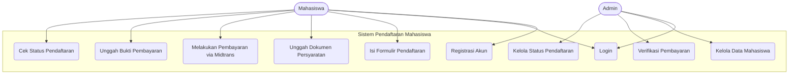
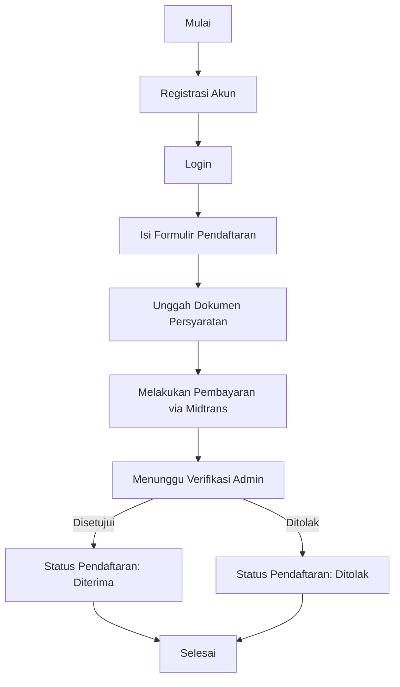

````markdown
# 📘 Dokumentasi Aplikasi Pendaftaran Mahasiswa

## 1. User Manual (Dokumentasi Fitur Aplikasi)

### Login & Registrasi

-   Pengguna baru dapat registrasi sebagai calon mahasiswa.
-   Login menggunakan email & password.

### Dashboard Mahasiswa

-   Menampilkan status pendaftaran.
-   Menampilkan bukti pembayaran.
-   Menampilkan program studi yang dipilih.

### Formulir Pendaftaran

-   Isi data pribadi dan data akademik.
-   Pilih program studi.
-   Unggah dokumen persyaratan.

### Pembayaran

-   Menampilkan informasi pembayaran.
-   Unggah bukti pembayaran.
-   Memantau status pembayaran.
-   Melakukan pembayaran melalui **Midtrans Payment Gateway**.

### Dashboard Admin

-   Admin login.
-   Kelola data mahasiswa.
-   Verifikasi pembayaran.
-   Menyetujui atau menolak pendaftaran.

### Notifikasi & Pesan

-   Sistem memberikan notifikasi terkait status pendaftaran dan pembayaran.

---

## 2. Developer Documentation (Dokumentasi Pengembangan Aplikasi)

### Lingkungan Pengembangan

-   **Framework**: Laravel 12
-   **Bahasa**: PHP 8.2, JavaScript
-   **Database**: MySQL / PostgreSQL
-   **Frontend**: Blade, TailwindCSS, Bootstrap
-   **Build Tool**: Vite
-   **Payment Gateway**: Midtrans

### Instalasi

```bash
git clone https://github.com/SenaPutra01/pendaftaran-mahasiswa.git
cd pendaftaran-mahasiswa
composer install
npm install
cp .env.example .env
php artisan key:generate
php artisan migrate --seed
php artisan serve
# npm run dev
```
````

### Konfigurasi Midtrans

Tambahkan konfigurasi berikut di file **`.env`**:

```env
MIDTRANS_SERVER_KEY=SB-Mid-server-xxxxxxxxxxxxxxxxxx
MIDTRANS_CLIENT_KEY=SB-Mid-client-xxxxxxxxxxxxxxxxxx
MIDTRANS_IS_PRODUCTION=false
```

Lalu di file `config/midtrans.php`:

```php
return [
    'server_key'    => env('MIDTRANS_SERVER_KEY'),
    'client_key'    => env('MIDTRANS_CLIENT_KEY'),
    'is_production' => env('MIDTRANS_IS_PRODUCTION', false),
    'is_sanitized'  => true,
    'is_3ds'        => true,
];
```

### Alur Pembayaran

1. Mahasiswa memilih metode pembayaran.
2. Sistem memanggil **Midtrans Snap API** untuk membuat transaksi.
3. Mahasiswa diarahkan ke halaman pembayaran Midtrans.
4. Setelah pembayaran berhasil/gagal, Midtrans mengirim notifikasi ke endpoint `midtrans/notification`.
5. Sistem mengupdate status pembayaran di database.

### Sample Endpoint (Controller)

```php
use Midtrans\Config;
use Midtrans\Snap;

public function createTransaction(Request $request)
{
    Config::$serverKey = config('midtrans.server_key');
    Config::$isProduction = config('midtrans.is_production');
    Config::$isSanitized = true;
    Config::$is3ds = true;

    $params = [
        'transaction_details' => [
            'order_id' => uniqid(),
            'gross_amount' => 500000,
        ],
        'customer_details' => [
            'first_name' => 'Mahasiswa',
            'email' => 'mahasiswa@example.com',
        ],
    ];

    $snapToken = Snap::getSnapToken($params);

    return response()->json(['snapToken' => $snapToken]);
}
```

### Struktur Folder

-   `app/Models` → Model
-   `app/Http/Controllers` → Controller (termasuk `PaymentController` untuk Midtrans)
-   `routes/web.php` → Routing
-   `resources/views` → Blade Template
-   `database/migrations` → Struktur tabel database
-   `public/` → Assets publik

### Fitur Utama

-   Autentikasi (Login/Register).
-   CRUD Mahasiswa.
-   Upload & Verifikasi Pembayaran.
-   Integrasi Midtrans untuk pembayaran online.
-   Admin Panel.

### Testing

```bash
php artisan serve
```

### Deployment

-   Gunakan PHP 8.2+.
-   Setup database production.
-   Setup Midtrans dengan mode **Production**.
-   Jalankan:

    ```bash
    php artisan config:cache
    php artisan route:cache
    ```

-   Gunakan supervisor/pm2 untuk queue notifikasi/email.

---

## 3. Sample Akun Login (Seeder)

Setelah menjalankan perintah:

```bash
php artisan migrate --seed
```

Maka data berikut otomatis tersedia:

### Admin & Staff

-   **Administrator** → `admin@universitas.ac.id / password123`
-   **Staff Administrasi** → `staff@universitas.ac.id / password123`

### Calon Mahasiswa

-   **Ahmad Rizki** → `ahmad.rizki@example.com / password123`
-   **Siti Rahayu** → `siti.rahayu@example.com / password123`
-   **Budi Santoso** → `budi.santoso@example.com / password123`
-   **Dewi Lestari** → `dewi.lestari@example.com / password123`
-   **Rudi Hermawan** → `rudi.hermawan@example.com / password123`

### Calon Mahasiswa Tambahan (Testing)

-   `calon1@example.com / password123`
-   `calon2@example.com / password123`
-   `calon3@example.com / password123`

---

## 4. Diagram Use Case



---

## 5. Flowchart Proses Pendaftaran


