# 📘 Aplikasi Pendaftaran Mahasiswa - Universitas Terbuka Digital


Sistem pendaftaran mahasiswa online dengan integrasi pembayaran Midtrans. Aplikasi ini memudahkan calon mahasiswa untuk mendaftar, mengunggah dokumen, dan melakukan pembayaran secara online dengan berbagai metode pembayaran.

## 📋 Daftar Isi

1. [User Manual](#1-user-manual-dokumentasi-fitur-aplikasi)
2. [Developer Documentation](#2-developer-documentation-dokumentasi-pengembangan-aplikasi)
3. [Sample Akun Login](#3-sample-akun-login-seeder)
4. [Diagram Use Case](#4-diagram-use-case)
5. [Flowchart Proses Pendaftaran](#5-flowchart-proses-pendaftaran)
6. [Simulasi Pembayaran Midtrans](#6-simulasi-pembayaran-midtrans-testing)

## 1. User Manual (Dokumentasi Fitur Aplikasi)

### Login & Registrasi

-   Pengguna baru dapat registrasi sebagai calon mahasiswa.
-   Login menggunakan email & password.

### Dashboard Mahasiswa

-   Menampilkan status pendaftaran.
-   Menampilkan bukti pembayaran.
-   Menampilkan program studi yang dipilih.
-   **Tombol "Cek Status Pembayaran"** untuk sinkronisasi manual status pembayaran.

### Formulir Pendaftaran

-   Isi data pribadi dan data akademik.
-   Pilih program studi.
-   Unggah dokumen persyaratan.

### Pembayaran

-   Menampilkan informasi pembayaran.
-   Melakukan pembayaran melalui **Midtrans Payment Gateway**.
-   Sinkronisasi manual status pembayaran via tombol khusus.

### Dashboard Admin

-   Admin login.
-   Kelola data mahasiswa.
-   Verifikasi pembayaran.
-   Menyetujui atau menolak pendaftaran.

### Notifikasi & Pesan

-   Sistem memberikan notifikasi terkait status pendaftaran dan pembayaran.

---

## 2. Developer Documentation (Dokumentasi Pengembangan Aplikasi)

### Lingkungan Pengembangan

-   **Framework**: Laravel 12
-   **Bahasa**: PHP 8.2, JavaScript
-   **Database**: PostgreSQL
-   **Frontend**: Blade, TailwindCSS, Bootstrap
-   **Payment Gateway**: Midtrans

### Instalasi

```bash
git clone https://github.com/SenaPutra01/pendaftaran-mahasiswa.git
cd pendaftaran-mahasiswa
composer install
npm install
cp .env.example .env
php artisan key:generate
php artisan migrate --seed
php artisan serve
# npm run dev
```

### Konfigurasi Midtrans

Tambahkan konfigurasi berikut di file **`.env`**:

```env
MIDTRANS_SERVER_KEY=SB-Mid-server-xxxxxxxxxxxxxxxxxx
MIDTRANS_CLIENT_KEY=SB-Mid-client-xxxxxxxxxxxxxxxxxx
MIDTRANS_IS_PRODUCTION=false
```

Lalu di file `config/midtrans.php`:

```php
return [
    'server_key'    => env('MIDTRANS_SERVER_KEY'),
    'client_key'    => env('MIDTRANS_CLIENT_KEY'),
    'is_production' => env('MIDTRANS_IS_PRODUCTION', false),
    'is_sanitized'  => true,
    'is_3ds'        => true,
];
```

### Alur Pembayaran

1. Mahasiswa memilih metode pembayaran.
2. Sistem memanggil **Midtrans Snap API** untuk membuat transaksi.
3. Mahasiswa diarahkan ke halaman pembayaran Midtrans.
4. Setelah pembayaran berhasil/gagal, Midtrans mengirim notifikasi ke endpoint `midtrans/notification`.
5. Sistem mengupdate status pembayaran di database.
6. Untuk pembayaran pending, pengguna dapat menggunakan **tombol "Cek Status Pembayaran"** yang memanggil endpoint `/debug/sync/{order_id}`.

### Struktur Folder

-   `app/Models` → Model (CalonMahasiswa, Pembayaran, ProgramStudi, User)
-   `app/Http/Controllers` → Controller (PaymentController, PendaftaranController, AdminController)
-   `routes/web.php` → Routing
-   `resources/views` → Blade Template
-   `database/migrations` → Struktur tabel database
-   `public/` → Assets publik

### Fitur Utama

-   Autentikasi (Login/Register).
-   CRUD Mahasiswa.
-   Upload & Verifikasi Pembayaran.
-   Integrasi Midtrans untuk pembayaran online.
-   Tombol sinkronisasi manual status pembayaran.
-   Admin Panel.

### Testing

```bash
php artisan serve
```

### Deployment

-   Gunakan PHP 8.2+.
-   Setup database production.
-   Setup Midtrans dengan mode **Production**.
-   Jalankan:
    ```bash
    php artisan config:cache
    php artisan route:cache
    ```
-   Gunakan supervisor/pm2 untuk queue notifikasi/email.

---

## 3. Sample Akun Login (Seeder)

Setelah menjalankan perintah:

```bash
php artisan migrate --seed
```

Maka data berikut otomatis tersedia:

### Admin & Staff

-   **Administrator** → `admin@universitas.ac.id / password123`
-   **Staff Administrasi** → `staff@universitas.ac.id / password123`

### Calon Mahasiswa

-   **Ahmad Rizki** → `ahmad.rizki@example.com / password123`
-   **Siti Rahayu** → `siti.rahayu@example.com / password123`
-   **Budi Santoso** → `budi.santoso@example.com / password123`
-   **Dewi Lestari** → `dewi.lestari@example.com / password123`
-   **Rudi Hermawan** → `rudi.hermawan@example.com / password123`

### Calon Mahasiswa Tambahan (Testing)

-   `calon1@example.com / password123`
-   `calon2@example.com / password123`
-   `calon3@example.com / password123`

---

## 4. Diagram Use Case

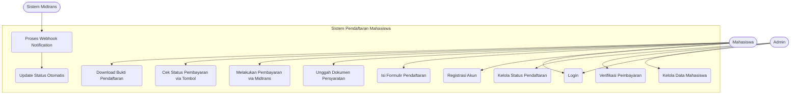

## 5. Flowchart Proses Pendaftaran

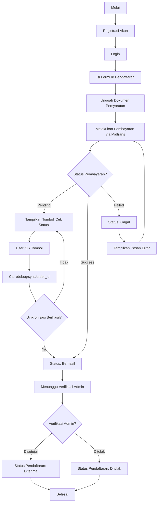

**Penjelasan Alur:**

1. **Pendaftaran Awal**: Calon mahasiswa melakukan registrasi dan login
2. **Pengisian Data**: Mengisi formulir dan mengunggah dokumen
3. **Pembayaran**: Melakukan pembayaran melalui Midtrans
4. **Status Pembayaran**:
    - **Pending**: Muncul tombol "Cek Status" untuk sinkronisasi manual
    - **Success**: Lanjut ke verifikasi admin
    - **Failed**: Tampilkan error dan bisa ulangi pembayaran
5. **Verifikasi Admin**: Admin mengecek kelengkapan data
6. **Hasil Akhir**: Diterima atau ditolak

Untuk tombol "Cek Status" di status pending, pengguna dapat mengklik tombol tersebut yang akan memanggil endpoint `/debug/sync/{order_id}` untuk sinkronisasi status pembayaran terbaru dari Midtrans.

---

## 6. Simulasi Pembayaran Midtrans (Testing)

### Simulator Pembayaran Sandbox

Untuk melakukan **simulasi pembayaran** dalam mode pengembangan/testing, Anda dapat menggunakan simulator Midtrans:

🔗 **Portal Simulator Midtrans:** https://simulator.sandbox.midtrans.com/v2/qris/index

Portal ini adalah pusat untuk menguji berbagai metode pembayaran yang diintegrasikan dengan aplikasi Anda.

### Metode Pembayaran yang Dapat Disimulasikan:

1. **QRIS** (openAPI & non openAPI) - Pembayaran via QR Code
2. **Deeplink** - Pembayaran via aplikasi e-wallet (GoPay, ShopeePay, dll)
3. **Virtual Account** - BCA, BRI, BNI, Permata, CIMB, Danamon, BSI, SeaBank, Mandiri Bill
4. **Over The Counter** - Alfamart, Indomaret
5. **Cardless Credit** - Akulaku

### Cara Menggunakan Simulator QRIS (Contoh):

1. **Buat transaksi** di aplikasi Anda dan dapatkan **Order ID**
2. **Buka simulator QRIS:** https://simulator.sandbox.midtrans.com/v2/qris/index
3. **Masukkan Order ID** ke dalam kolom yang tersedia
4. **Pilih skenario** yang diinginkan (Success, Pending, Expire, dll.)
5. **Klik submit** untuk mengirim simulasi
6. **Midtrans** akan mengirimkan webhook notification ke endpoint callback Anda
7. **Status pembayaran** akan otomatis terupdate di database

### Cara Menggunakan Simulator Umum:

1. Setelah transaksi dibuat, sistem akan menghasilkan **order ID** (misal: `ORDER-12345`)
2. Buka halaman simulator: https://simulator.sandbox.midtrans.com
3. Masukkan **order ID** yang dihasilkan
4. Pilih **simulasi respon** yang diinginkan:
    - ✅ **Success** - Pembayaran berhasil
    - ❌ **Deny** - Pembayaran ditolak
    - ⏳ **Pending** - Pembayaran tertunda
    - 🔄 **Expire** - Pembayaran kadaluarsa
    - ↩️ **Cancel** - Pembayaran dibatalkan

### Data Testing untuk Berbagai Metode:

#### **Kartu Kredit:**

-   **Success (3D Secure):**

    -   Nomor Kartu: `4811 1111 1111 1114`
    -   Tanggal Kadaluarsa: Bulan/tahun di masa depan
    -   CVV: `123`
    -   OTP: `112233`

-   **Deny (Transaksi Gagal):**
    -   Nomor Kartu: `4911 1111 1111 1113`
    -   Tanggal dan CVV bebas

#### **Virtual Account Testing:**

-   **Bank BCA:** `3901 + random 12 digit`
-   **Bank BNI:** `8808 + random 12 digit`
-   **Bank BRI:** `8000 + random 12 digit`

### Endpoint Sinkronisasi Manual di Aplikasi:

Aplikasi menyediakan endpoint khusus untuk sinkronisasi manual status pembayaran:

```
GET /debug/sync/{order_id}
```

**Response Contoh:**

```json
{
    "success": true,
    "message": "Status berhasil diperbarui",
    "data": {
        "order_id": "ORDER-12345",
        "status": "settlement",
        "transaction_status": "capture",
        "payment_type": "qris"
    }
}
```

**Cara Kerja:**

1. Pengguna klik tombol **"Cek Status Pembayaran"** di dashboard
2. Aplikasi mengirim request ke `/debug/sync/{order_id}`
3. Sistem mengecek status terbaru ke Midtrans
4. Status diperbarui di database
5. Halaman direfresh untuk menampilkan status terbaru

### Troubleshooting Simulasi:

| Masalah                             | Solusi                                                                                                                   |
| ----------------------------------- | ------------------------------------------------------------------------------------------------------------------------ |
| Webhook tidak terkirim              | Pastikan server development bisa diakses dari internet (gunakan ngrok/localtunnel)                                       |
| Status tidak berubah                | 1. Cek endpoint notification di Midtrans Dashboard<br>2. Panggil `/debug/sync/{order_id}` manual<br>3. Cek logs aplikasi |
| Error invalid signature             | Pastikan server key di `.env` sesuai dengan akun Midtrans sandbox                                                        |
| Tombol "Cek Status" tidak berfungsi | 1. Cek console browser untuk error JavaScript<br>2. Verifikasi endpoint route sudah terdaftar<br>3. Cek koneksi internet |

### Tips Penting:

1. **Mode Sandbox Only**: Simulator hanya berfungsi untuk mode sandbox (`MIDTRANS_IS_PRODUCTION=false`)
2. **Credential Sandbox**: Selalu gunakan credential sandbox untuk development
3. **Endpoint Debug**: Hapus endpoint `/debug/sync/` saat deployment production
4. **Production Mode**: Ubah `MIDTRANS_IS_PRODUCTION` menjadi `true` saat deploy ke production
5. **Webhook URL**: Pastikan URL webhook di Midtrans Dashboard mengarah ke endpoint `https://domain-anda.com/midtrans/notification`

### Alur Testing Lengkap:

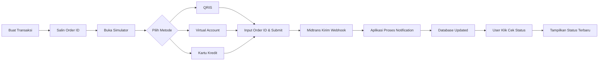

## 📸 Tampilan Aplikasi

Berikut adalah screenshot dari berbagai fitur dan halaman dalam aplikasi Pendaftaran Mahasiswa Universitas Terbuka Digital:

### Tampilan Login

Berikut adalah tampilan halaman login aplikasi yang digunakan oleh calon mahasiswa, admin, dan staff untuk mengakses sistem. Halaman ini memiliki formulir sederhana untuk email, password, serta opsi "Remember Me".
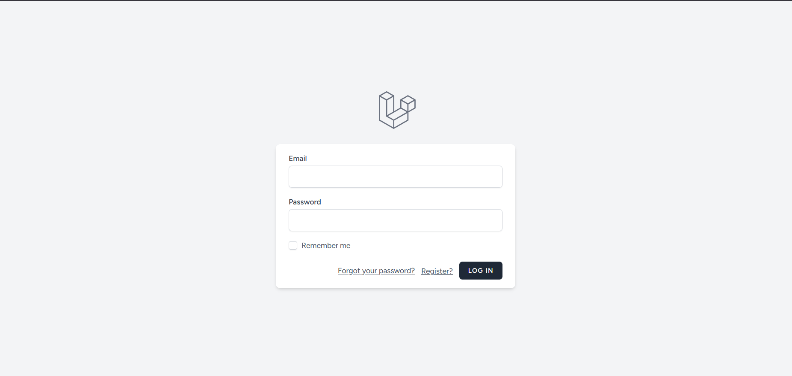

### Menu Admin

#### Halaman Dashboard Admin

Dashboard utama admin yang menampilkan statistik lengkap tentang pendaftaran, grafik aktivitas, dan notifikasi penting. Admin dapat melihat ringkasan keseluruhan sistem dari halaman ini.


#### Halaman Manage Fakultas

Antarmuka untuk mengelola data fakultas yang tersedia di universitas. Admin dapat menambah, mengedit, atau menghapus fakultas serta melihat daftar lengkap fakultas yang ada.
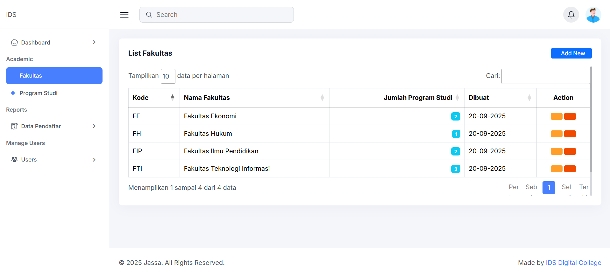

#### Halaman Manage Prodi

Halaman untuk mengelola program studi (prodi) di setiap fakultas. Admin dapat mengatur kuota pendaftaran, syarat khusus, dan informasi penting lainnya untuk setiap prodi.
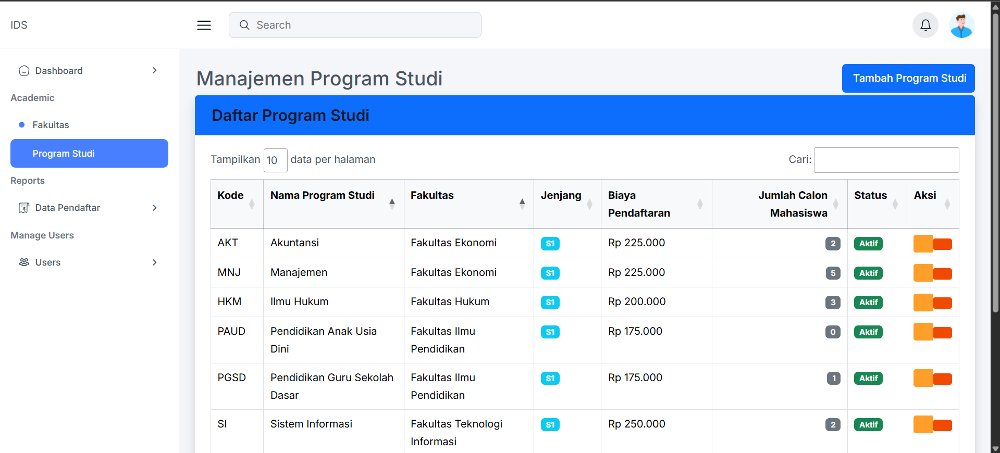

#### Halaman Manage Data Pendaftar

Panel kontrol untuk melihat dan memverifikasi data calon mahasiswa. Admin dapat meninjau dokumen, status pembayaran, dan melakukan approval atau rejection terhadap pendaftaran.
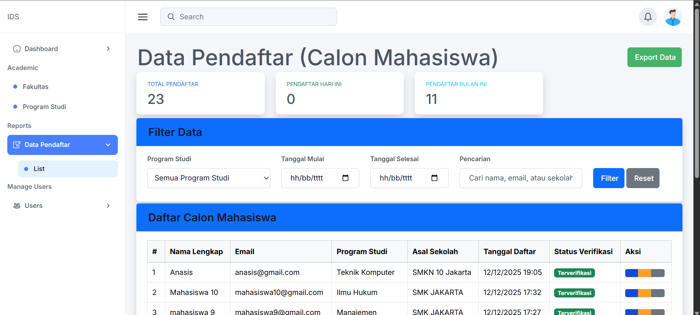

#### Halaman Manage User

Antarmuka untuk mengelola semua pengguna sistem termasuk admin, staff, dan calon mahasiswa. Fitur ini memungkinkan reset password, aktivasi akun, dan pengaturan role/permission.
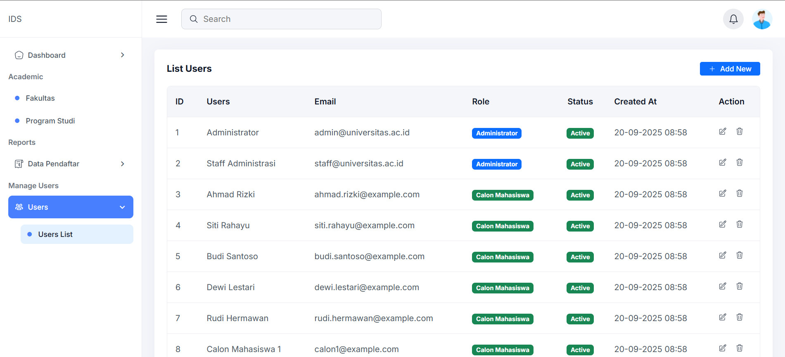

### Menu Calon Mahasiswa

#### Halaman Register

Formulir pendaftaran awal untuk calon mahasiswa baru. Pengguna baru dapat membuat akun dengan mengisi data dasar seperti nama, email, dan password.
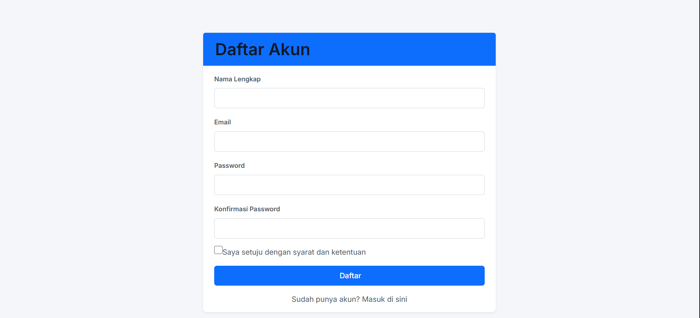

#### Halaman Dashboard Mahasiswa

Dashboard pribadi calon mahasiswa yang menampilkan status pendaftaran, progress pengisian formulir, notifikasi, dan tombol aksi untuk melanjutkan proses pendaftaran.
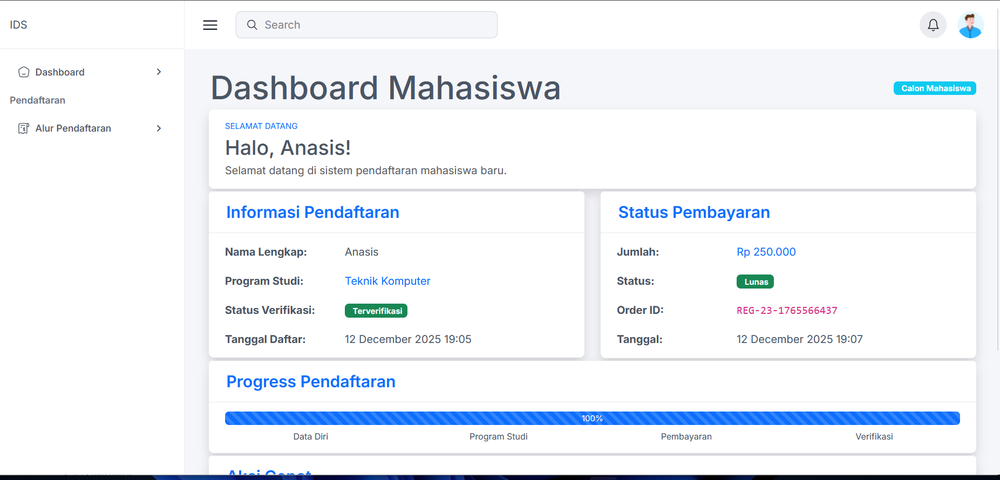

#### Halaman Alur Pendaftaran

Halaman yang menjelaskan step-by-step proses pendaftaran dari awal hingga akhir. Menyediakan panduan visual dan penjelasan setiap tahapan yang harus dilalui.

#### Halaman Data Diri

Formulir lengkap untuk pengisian data pribadi calon mahasiswa termasuk informasi kontak, alamat, data orang tua, dan informasi pendidikan sebelumnya.
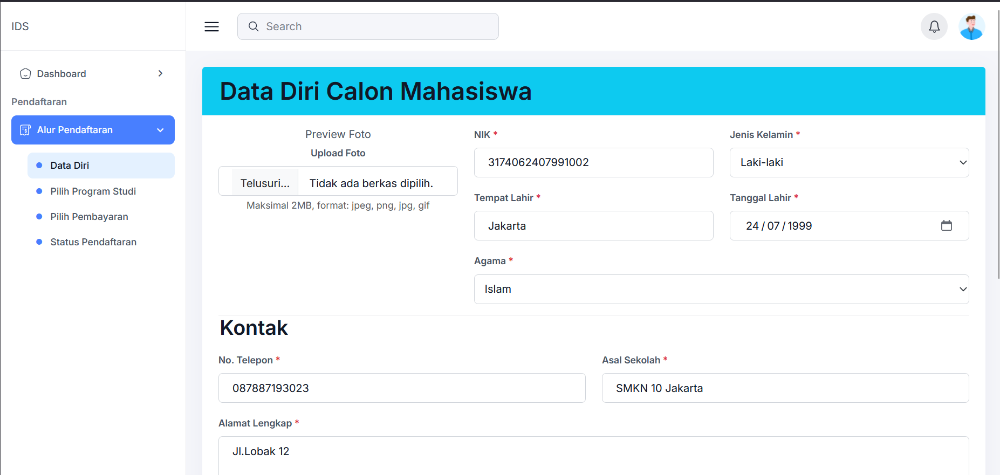

#### Halaman Pilih Program Studi

Halaman pemilihan fakultas dan program studi. Calon mahasiswa dapat melihat daftar prodi yang tersedia, kuota, dan persyaratan khusus sebelum memilih.
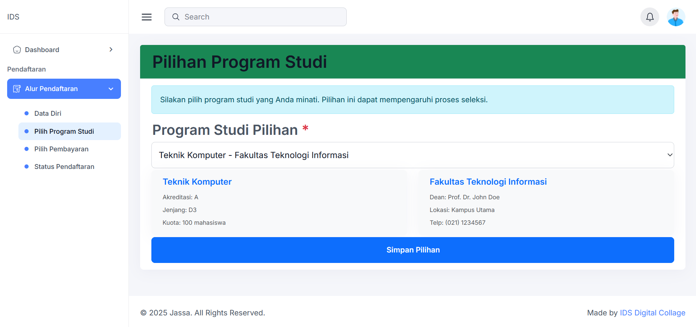

#### Halaman Pilih Pembayaran

Antarmuka untuk memilih metode pembayaran biaya pendaftaran melalui Midtrans. Menyediakan berbagai opsi seperti QRIS, virtual account, e-wallet, dan kartu kredit.
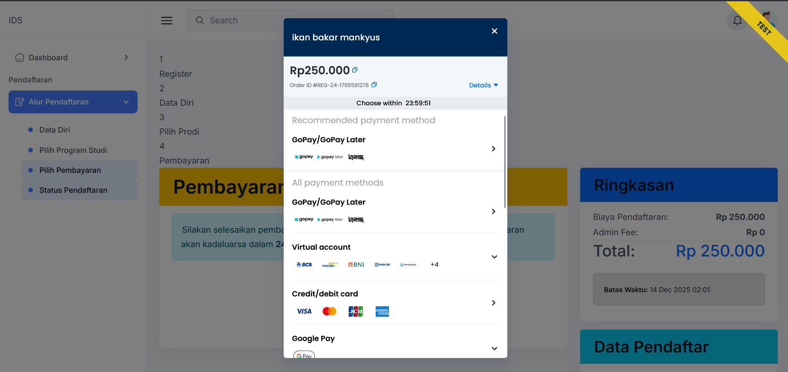

#### Halaman Status Pembayaran

Halaman monitoring yang menampilkan status pembayaran secara real-time. Terdapat tombol "Cek Status" untuk sinkronisasi manual dan detail transaksi lengkap.
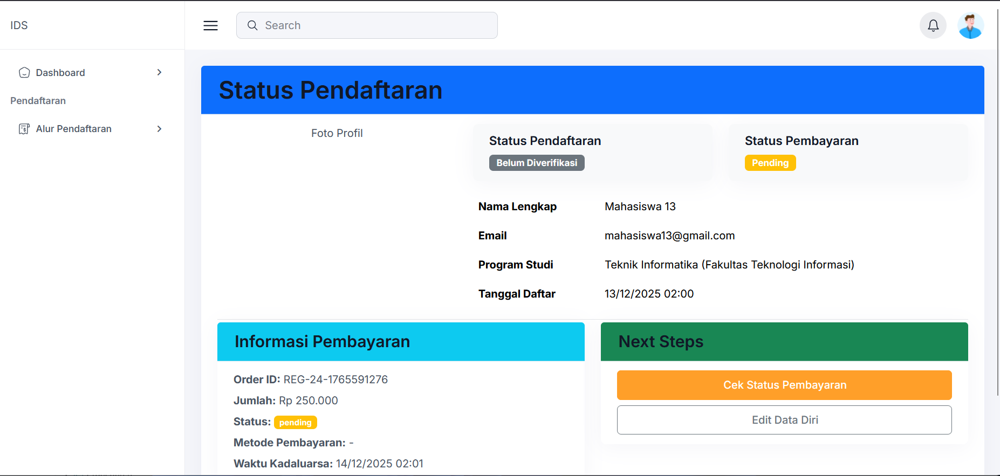
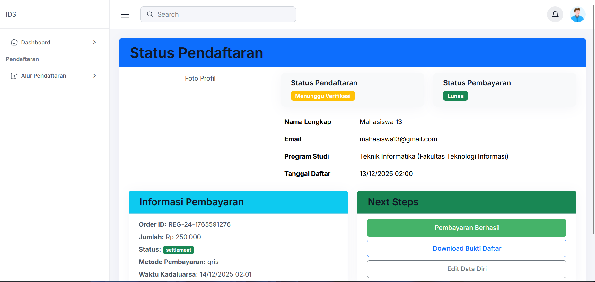
